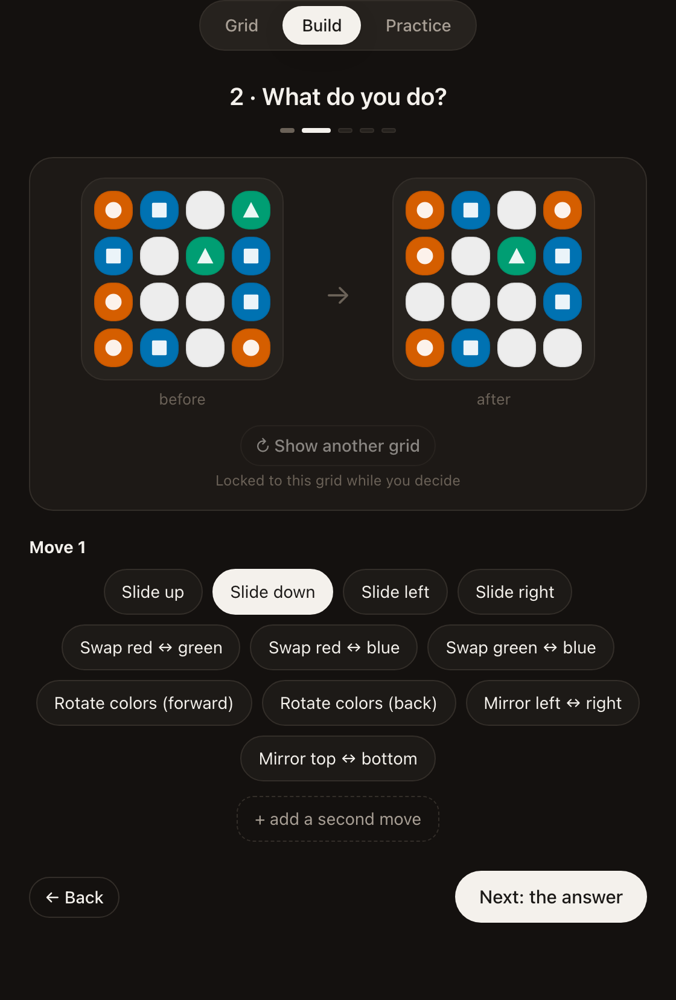
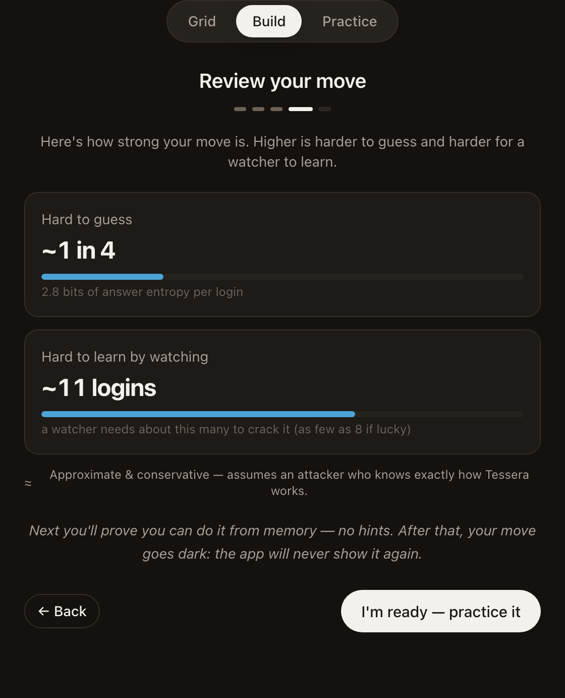

# Tessera

Tessera is a second factor where the secret is a *move you perform in your head*, not a code you copy.

A normal authenticator shows you six digits to retype. Tessera shows you a grid of colored shapes that rolls every 45 seconds. You apply a transformation you've memorized, then tap one small fact about the result. The grid changes every login; the move never does. Someone can watch you authenticate a hundred times and see a hundred different grids, but never the rule connecting them.

This is a learning project. It is not audited, not a product, and not protecting anything real. The interesting part isn't the app, it's the constraint that makes it work: the move is picked from a **finite, enumerable menu of 57,024 rules**, which is exactly what lets a server verify it while storing only a hash.

<p align="center">
  
</p>

## The three moving parts

**The grid** is public. Both your device and the server derive it from a shared seed and the current time slice, exactly like a TOTP code, except it's a picture instead of digits.

**The move** is your secret. It's a three-stage pipeline you assemble once: pick which cells to attend to, apply one or two transformations, then report one fact about the result. For example: *only the red cells → slide them down → how many reds are there now?*

**The answer** is a single scalar you tap. That last part is load-bearing. Tapping back the whole transformed grid would hand an observer a complete input/output example of your rule on every single login. A scalar reveals one projection instead, which caps how fast the move leaks. The strength meter estimates that rate directly.

<p align="center">
  
  
</p>

## Verifying a secret the server never stores

Because the rule is a selection from a fixed menu, the encoded move behaves like a password chosen from a structured space, and "verify a secret you don't store" is a solved problem. The grid isn't secret, so the move is the only thing worth protecting.

The server stores `hash(canonical(R))` and nothing else. At login it re-derives the grid, walks the menu, keeps every candidate rule that would have produced your answer on *this* grid, and checks whether any of them hashes to the stored fingerprint.

```
                    THE GRID  C(t)  — public, rolls every period, identical
                              on every device (derived from a shared seed)
                                        │
        build once (move shown ONCE)    │  every login (move stays in your head)
  ┌─────────────────────────────┐       │      ┌──────────────────────────────┐
  │ SELECT → TRANSFORM → READOUT │       │      │ see grid → do move in head →  │
  │   = your secret rule R       │       │      │   tap a small answer A        │
  └──────────────┬──────────────┘       │      └───────────────┬──────────────┘
                 │ store hash(R) only    │                      │ A
                 ▼                       ▼                      ▼
            ┌─────────────────────────────────────────────────────┐
            │ VERIFIER: re-derive C(t), enumerate the finite menu,  │
            │ find a rule that yields A and whose hash matches.     │
            │ → PASS / FAIL.  Never learns which rule is yours.     │
            └─────────────────────────────────────────────────────┘
```

Many rules produce the same answer on any given grid, so one login narrows things very little. The server learns your answer and that *some* rule producing it matched. It never learns which.

The move is displayed in exactly one place, the builder, and visibility ends at a dry-run gate that makes you perform it from memory with no hints before enrollment completes. After that the app has no way to show it to you, because it no longer has it.

## Running it

```sh
npm install
npm run dev          # http://localhost:5173
```

Pick **Build & practice a move** on the home screen. It runs entirely in the browser with no backend and no network. Build a move, pass the memory gate, then drill it.

A good first move is *all cells → slide down → count of red*. A count is the easiest answer to tap while you're still learning.

The two-device flow (phone as authenticator, laptop as the app being logged into) needs your own Supabase project. See [Backend setup](#backend-setup).

## How it's built

The engine is one codebase that runs identically in the browser, in Node under test, and in Deno on the server. That last part is the only real trap in the repo, so it's worth stating plainly: Deno can't resolve the Node-style `.js` specifiers that `src/` uses, so `npm run sync:edge` copies the pure modules into `supabase/functions/_shared/engine/` and rewrites the imports. That folder is generated and committed, never hand-edited. Change anything on the verify path without re-running the sync and the server will happily verify against stale logic.

```
src/
  engine/                 the pure core
    types.ts                canonical rule encoding + grid/cell model
    grid.ts · prng.ts       immutable grids; deterministic cross-platform PRNG
    clock.ts                C(t) = grid(seed, tick); degenerate-grid rejection
    rule.ts                 SELECT → TRANSFORM(×≤2) → READOUT — the pipeline R(C)→answer
    enumerate.ts            the finite rule space (18 selects × 11 transforms × 24 readouts)
    strength.ts             entropy + Monte-Carlo crack estimate
    readout-shape.ts        the answer's shape, so the UI renders input without the rule
  auth/
    verifier.ts             the Verifier seam (Option A cleartext ↔ Option B hash-based)
    option-b-verifier.ts    the shipped one: store hash(R), verify by enumeration
    canonical.ts            stable serialization — the hash input
    verifyhash.ts           pure-JS SHA-256 (browser + Deno safe)
    login.ts                grace window, rate limit, replay defense
  ui/                     React + Vite; palette is colorblind-safe (hue + redundant shape)

supabase/
  migrations/             enrollments, login_sessions, auth_attempts (+ RLS)
  functions/verify/       one Edge Function routed by action: enroll / start-login / claim / submit
```

There are two SHA-256 implementations on purpose. `verifyhash.ts` is pure JS so it survives the sync into Deno; `slowhash.ts` uses `node:crypto` scrypt and deliberately does not.

```sh
npm test             # 153 tests: engine, auth, ui
npm run typecheck    # strict tsc (noUncheckedIndexedAccess, exactOptionalPropertyTypes)
npm run build        # typecheck + production bundle
npm run sync:edge    # regenerate the Edge Function's engine copy
```

## What it defends, and what it doesn't

Two attacks motivate the whole design, and it handles both:

A **shoulder-surfer** sees public grids and one-scalar answers. Neither reveals the move, and the answer's small size is what throttles inference across repeat viewings.

A **stolen or compromised phone** yields nothing, because the move isn't on the phone. It's in your head, and the device holds only a hash. This is the row where plain TOTP breaks outright, since a leaked TOTP seed is game over.

The honest limits, which are disclosed rather than buried:

**A leaked verifier hash is brute-forceable offline.** 57,024 candidates is small, and the shipped verifier uses fast SHA-256. This was a deliberate trade: a slow hash (scrypt) pushes a legitimate login to roughly 17 seconds, because verification enumerates hundreds of candidates and hashes each one. Fast SHA-256 makes a worst-case verify about 43ms. Online guessing is rate-limited, so the weakness is specifically an offline attack against a stolen database. `slowhash.ts` is kept for deployments willing to pay the latency, and an optional server-held pepper narrows it further. [DESIGN.md §6](./DESIGN.md#6-verification--how-the-server-checks-without-storing-the-move) walks through the reasoning.

**Repeated observation degrades the secret.** An attacker who records enough `(grid, answer)` pairs can eliminate inconsistent rules until one survives. This is a real limit, not a hypothetical, so the strength meter simulates that exact attack and reports the number to your face before you commit to a move. Weak moves are cracked in about 11 observations. That number is shown at enrollment on purpose.

**It hasn't been audited** and invents no new cryptography.

## Backend setup

Only needed for the two-device flow. You'll need your own Supabase project.

```sh
cp .env.example .env      # fill in VITE_SUPABASE_URL and VITE_SUPABASE_ANON_KEY
supabase link --project-ref <your-project-ref>
supabase db push
supabase functions deploy verify --no-verify-jwt
```

Both env values are public by design. The anon key ships in the browser bundle, and access is enforced by row-level security plus the Edge Function. The `service_role` key should never appear in either file.

With the backend up, open the app on two devices on the same network (`npm run dev -- --host`), choose **Log in to the demo app** on one and **Be the authenticator** on the other. Verification runs server-side and the result is pushed back over Realtime.

## Design notes

[DESIGN.md](./DESIGN.md) is the decision record. It documents why the readout is a scalar, why the rule space has to stay enumerable, and the fast-versus-slow-hash trade in detail. Its §9 invariants are load-bearing: the move is shown only in the builder, the raw rule is never stored, the rule space stays finite, and forgiveness lives in the time domain rather than in fuzzy answer matching.

If you change core behavior, read §9 first. Most of those invariants are one careless commit away from being silently reverted, and a "review your move" settings screen would undo the entire premise.

## License

[PolyForm Noncommercial 1.0.0](./LICENSE). Free to use, study, modify, and share for noncommercial purposes, with attribution.
